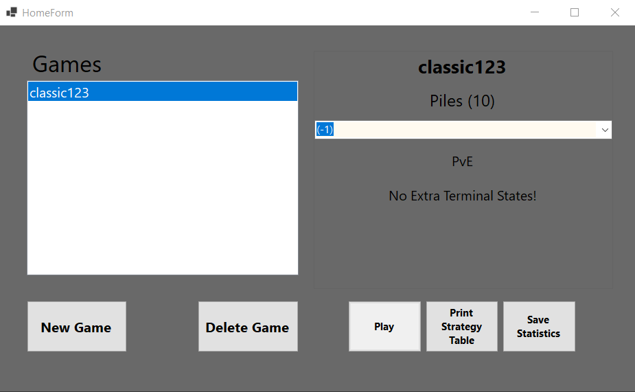

# Pebble Game Strategy Application (C#)
- Program I wrote for my BSc Diploma at University of Pannonia.
- It is entirely made with C# (.NET 7) and the GUI was built using Windows Forms. This program makes it possible to create, play and analyze pebble games.
- Pebble games are two player games where each turn one of the 2 players takes away (or adds) pebbles to one or more piles until one player cannot move which means the end of the game.
- For the program to run the 3 string variables have to be set in the `Paths.cs` class in the following format: `{directory_path}/GameOfPebbles/res/{resource_folder}`. There are 3 resource folders: *GameStatistics*, *GameStrategyTables* and *GameTemplates*. The *GameTemplates* folder contains the created games in `json` format and it contains one game by default: `classic123.json`.
- When we run the program the following window pops up.
 
- Additional games can be created by clicking on the **New Game** button. The available games are in a list on the left. After selecting a game a short preview comes up on the right. Play the game by clicking **Play**, print the strategy table by clicking **Print Strategy Table** which saves the table in an Excel file, or save the game statistics in a .txt file by clicking **Save Statistics**.
- **Note:** The program mostly works fine but printing the strategy table and saving statistics might take a lot of time for more complicated games. The game most likely needs further optimization, also additional features and a more advanced GUI are in the works.
